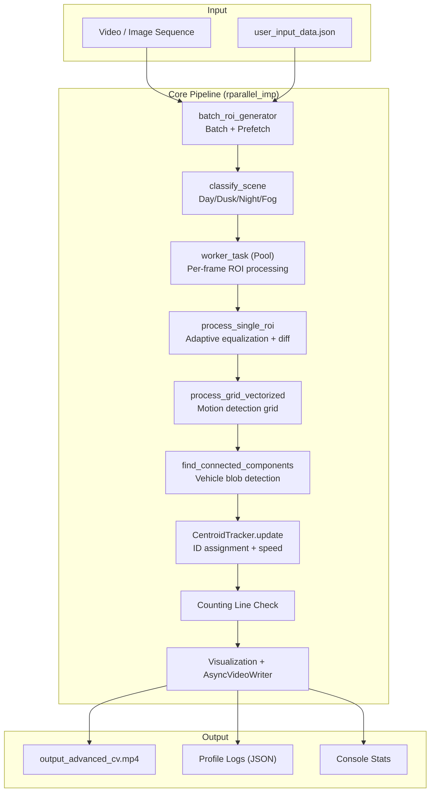
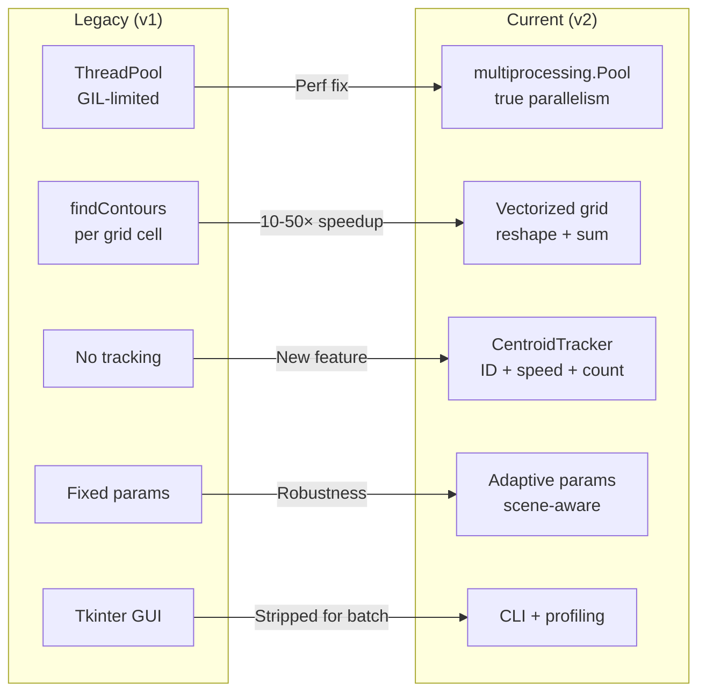
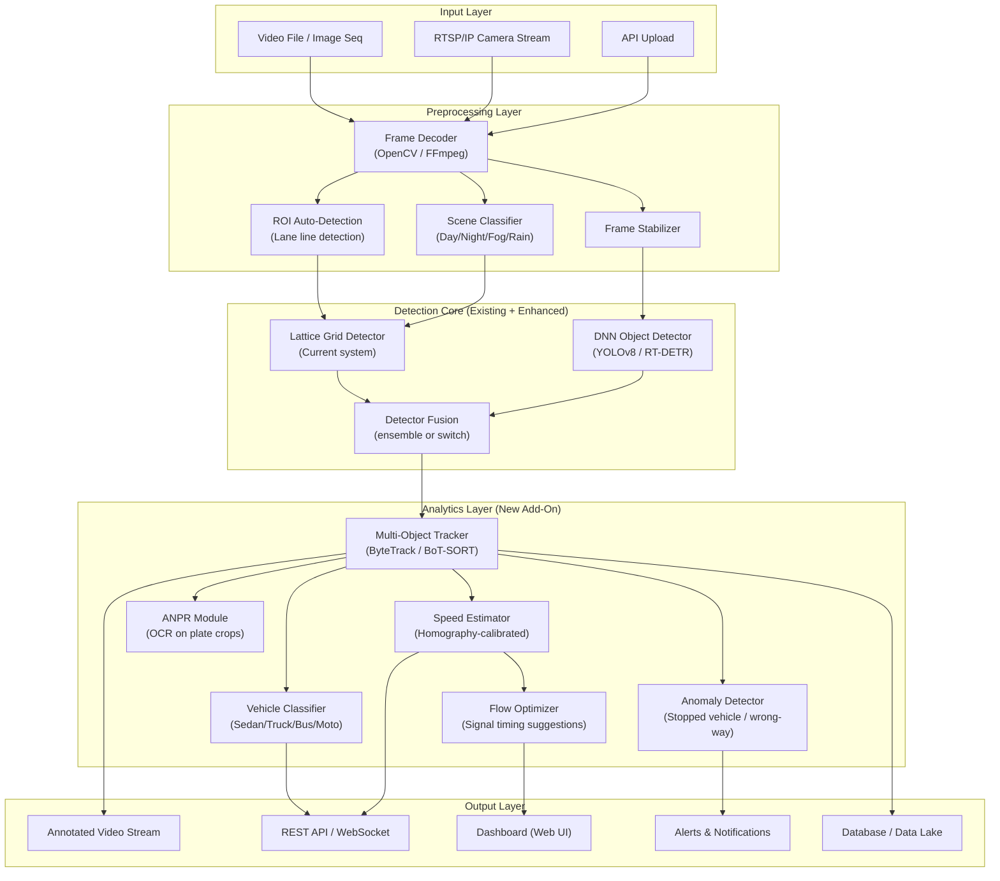

# Traffic System Analysis — Technical Audit & Expansion Roadmap

> **Prepared for**: Traffic System Analysis Platform Team
> **Date**: 2026-02-17
> **Role**: Senior Computer Vision & Software Architect

---

# Part 1: Technical Audit & Documentation (The "Now")

---

## 1. System Overview — Current Codebase Architecture

The **Current Codebase** (`LLVD-latest`) is a classical computer-vision traffic analysis pipeline built entirely in Python. It contains two independent processing implementations:

### 1.1 Files

| File | Lines | Purpose |
|------|-------|---------|
| [rparallel_imp (1).py](file:///e:/WORK/additionalProject/LLVD-latest/rparallel_imp%20(1).py) | 863 | **Advanced Pipeline** — multiprocessing, tracking, speed estimation, fog/night adaptation |
| [honors_imp (1).py](file:///e:/WORK/additionalProject/LLVD-latest/honors_imp%20(1).py) | 452 | **Base Pipeline** — multiprocessing, DBSCAN clustering, bounding-box generation |
| [user_input_data.json](file:///e:/WORK/additionalProject/LLVD-latest/user_input_data.json) | 8 | Runtime configuration (video path, color channel, grid dims) |

### 1.2 Architecture Diagram



### 1.3 Problems the Current System Solves

| Capability | Implementation | File |
|---|---|---|
| **Vehicle Detection** | Frame-differencing → grid-based motion → connected components | `rparallel_imp` |
| **Traffic Density** | Ratio of occupied grid cells to total cells, per-lane | Both files |
| **Vehicle Counting** | Centroid tracker + counting line crossing | `rparallel_imp` |
| **Speed Estimation** | Pixel displacement × calibration factor → km/h (EMA smoothed) | `rparallel_imp` |
| **Scene Adaptation** | Day/dusk/night classification + fog detection via Dark Channel Prior | `rparallel_imp` |
| **Dehazing** | Dark Channel Prior + guided filter refinement | `rparallel_imp` |
| **Vehicle Clustering** | DBSCAN on active grid cells → bounding boxes | `honors_imp` |
| **Parallel Processing** | `multiprocessing.Pool` with batched frame pairs | Both files |

### 1.4 Key Design Decisions

- **Lattice/Grid-based detection** instead of contour-based: The frame is divided into a configurable grid (e.g., 7×14), and each cell is independently checked for motion via pixel threshold counting. This is the "Lattice Layer" concept.
- **Frame differencing** (not background subtraction): Motion is detected by `cv2.absdiff(frame_n, frame_n+1)`, making the system stateless across frames.
- **Hardcoded ROI coordinates**: Two fixed regions (`ROI1 = (545, 159, 284, 140)` and `ROI2 = (238, 161, 284, 140)`) corresponding to two lanes.
- **Grayscale fast-path**: When [gray](file:///e:/WORK/additionalProject/Lattice-Layer-Vehicle-Detection-/seq.py#114-123) or `V` channel is selected, an optimized single-channel path is used.
- **Async video writing**: A dedicated writer thread with a queue decouples frame writing from processing.
- **Function-level profiling**: A custom `@time_function` decorator tracks exclusive wall-clock time, merged across worker processes via JSON logs.

---

## 2. Legacy vs. Current — Evolution Analysis

### 2.1 Side-by-Side Comparison

| Aspect | Legacy (`Lattice-Layer-Vehicle-Detection-`) | Current (`LLVD-latest`) |
|---|---|---|
| **Parallelism** | `ThreadPoolExecutor` (GIL-bound) | `multiprocessing.Pool` (true parallelism) |
| **Grid Processing** | Per-cell contour finding (`findContours`) | Vectorized `reshape + sum` (10-50× faster) |
| **Histogram Eq.** | Basic `cv2.equalizeHist` | Adaptive CLAHE (night/dusk) + standard (day) |
| **Scene Awareness** | None | Day/dusk/night + fog via Dark Channel Prior |
| **Dehazing** | None | DCP-based dehazing with guided filter |
| **Vehicle Tracking** | None | Centroid-based tracker with ID persistence |
| **Vehicle Counting** | None — density only | Counting-line crossing detection |
| **Speed Estimation** | None | Pixel-to-meter + EMA smoothing |
| **Clustering** | None in parallel ver.; DBSCAN in sequential | Connected components (OpenCV); DBSCAN in `honors_imp` |
| **Input Support** | [.mp4](file:///e:/WORK/additionalProject/Lattice-Layer-Vehicle-Detection-/seq_output.mp4)/`.avi` files only | Video files **+ image sequences** (folder of JPGs) |
| **Output** | Annotated video + optional Excel | Annotated video + JSON profiling logs |
| **GUI** | Tkinter-based GUI | Removed (CLI-only) |
| **Configuration** | JSON with `execution_mode` field | JSON without mode field (parallel-only) |
| **Profiling** | `cProfile` | Custom `@time_function` decorator with cross-process merge |
| **ROI Coordinates** | [(680,350,200,180)](file:///e:/WORK/additionalProject/LLVD-latest/honors_imp%20%281%29.py#290-443) / [(360,350,200,180)](file:///e:/WORK/additionalProject/LLVD-latest/honors_imp%20%281%29.py#290-443) | [(545,159,284,140)](file:///e:/WORK/additionalProject/LLVD-latest/honors_imp%20%281%29.py#290-443) / [(238,161,284,140)](file:///e:/WORK/additionalProject/LLVD-latest/honors_imp%20%281%29.py#290-443) |
| **Binary Threshold** | 20 | 75 (day), 30 (night), 40 (dusk/fog) |
| **Grid Default** | 6×6 | 7×14 |

### 2.2 What Changed and Why



> [!IMPORTANT]
> The most impactful architectural change was the migration from `ThreadPoolExecutor` to `multiprocessing.Pool`. Python's GIL makes threads ineffective for CPU-bound OpenCV operations. The legacy code was essentially running single-threaded despite using a thread pool.

---

## 3. Data Stream Analysis — MVI_39761

### 3.1 Dataset Overview

| Property | Value |
|---|---|
| **Source** | UA-DETRAC benchmark dataset |
| **Sequence** | MVI_39761 |
| **Total Frames** | 1,660 sequential JPEGs |
| **Resolution** | 960 × 540 pixels |
| **File Size** | ~43–48 KB per frame |
| **Estimated FPS** | 25 fps |
| **Duration** | ~66 seconds |

### 3.2 Visual Analysis — Sample Frames

````carousel

<!-- slide -->

<!-- slide -->

````

### 3.3 Data Challenges Identified

| Challenge | Severity | Description |
|---|---|---|
| **Dusk/Twilight Lighting** | 🔴 High | Overcast sky with low ambient light. Vehicles rely on headlights/taillights, creating high dynamic range situations. Pavement appears low-contrast gray. |
| **Headlight Glare** | 🟡 Medium | Oncoming vehicles produce bright spots that can generate false motion detection, especially on wet-looking road surface. |
| **Road Surface Reflections** | 🟡 Medium | The pavement shows specular reflections from headlights, producing ghost detections in frame-differencing. |
| **Perspective Distortion** | 🟡 Medium | Camera is elevated (overpass view). Vehicles far away are tiny (~10-15 px), while near vehicles are larger (~80-100 px). This affects tracking accuracy. |
| **Multi-Lane Width** | 🟡 Medium | ~6 lanes in each direction. The current system uses only 2 fixed ROIs, potentially missing lanes. |
| **Mixed Vehicle Types** | 🟢 Low | Sedans, taxis, buses, trucks, motorcycles present. Important for future classification features. |
| **Sparse-to-Moderate Density** | 🟢 Low | Traffic is never heavily congested in this sequence, reducing occlusion challenges. |
| **Static Background** | 🟢 Low | Trees and buildings are relatively static, reducing false positives from background motion. |

### 3.4 How the Current System Handles This Data

- **CLAHE + scene classification** adaptively boosts contrast in the ROI for dusk conditions, mitigating the low-light challenge.
- **Dark Channel Prior** detects potential fog/haze (the overcast sky could trigger mild fog detection).
- **Adaptive thresholding** (75 for day, 30 for night, 40 for dusk) helps avoid false positives from headlight glare.
- **Hardcoded ROI limitation**: The fixed ROI coordinates [(545,159,284,140)](file:///e:/WORK/additionalProject/LLVD-latest/honors_imp%20%281%29.py#290-443) and [(238,161,284,140)](file:///e:/WORK/additionalProject/LLVD-latest/honors_imp%20%281%29.py#290-443) cover only a portion of the 960×540 frame, likely targeting two specific lanes rather than the full road width.
- **Grid resolution** (7×14 = 98 cells) provides fine-grained spatial detection within each ROI.

> [!WARNING]
> The hardcoded ROI coordinates were likely tuned for a different camera angle. For MVI_39761 (UA-DETRAC), these coordinates may not perfectly align with the actual lane positions. **This is the biggest immediate risk** when running the current system on this data.

---

# Part 2: The Expansion Plan (The "Future")

---

## 4. Proposed Architecture for the Add-On

### 4.1 Design Philosophy

The add-on should follow a **modular microservice-inspired architecture** that wraps the existing pipeline as a "Detection Core" and builds new capabilities as independent, pluggable modules.

### 4.2 Target Architecture



### 4.3 Key Architectural Principles

| Principle | Rationale |
|---|---|
| **Detector-agnostic tracking** | The tracker should accept bounding boxes from ANY detector (grid-based, YOLO, or both). This lets you swap/upgrade detectors without rewriting tracking. |
| **Config-driven ROI** | All ROI coordinates must come from config or auto-detection. Zero hardcoded pixel values. |
| **Pipeline as directed graph** | Each stage is a node with defined inputs/outputs. Stages can be enabled/disabled per deployment. |
| **Gradual DNN integration** | Don't abandon the lattice detector. Instead, run it alongside a DNN detector and fuse results. The lattice detector is fast and lightweight — ideal as a "first-pass" filter. |
| **Calibration registry** | Each camera has a calibrated homography matrix, pixel-per-meter ratio, and lane mask stored in a config file. |

---

## 5. Feasibility Check — Advanced Features

### Given the MVI_39761 data quality, here is an honest assessment:

| Feature | Feasibility | Confidence | Notes |
|---|---|---|---|
| **Vehicle Counting** | ✅ Already works | 🟢 High | Current centroid tracker handles this. Accuracy can improve with DNN detections. |
| **Traffic Density** | ✅ Already works | 🟢 High | Grid-based density calculation is solid. |
| **Speed Estimation** | ⚠️ Partially works | 🟡 Medium | Current pixel-based speed is uncalibrated. Needs camera homography calibration for real-world accuracy. At 960×540 resolution, there's enough pixel detail for reasonable estimates. |
| **Vehicle Classification** | ✅ Feasible | 🟢 High | Vehicles are distinguishable (buses vs. sedans vs. motorcycles). YOLOv8 can classify at this resolution reliably. |
| **ANPR (License Plates)** | ⚠️ Challenging | 🔴 Low | At 960×540 from an overpass, license plates are **10-20 pixels wide** — far below the ~100px minimum needed for reliable OCR. Would require a dedicated plate-reader camera at lane level. |
| **Accident/Anomaly Detection** | ✅ Feasible | 🟡 Medium | Stopped vehicles and wrong-way driving are detectable via trajectory analysis. Actual collision detection is very difficult from this viewpoint. |
| **Flow Optimization** | ✅ Feasible | 🟡 Medium | Requires accumulating density + speed data over time and modeling signal timing. The data pipeline exists; the optimization model is the new work. |
| **Wrong-Way Detection** | ✅ Feasible | 🟢 High | Easy to detect: track direction vs. expected lane direction. |
| **Queue Length Estimation** | ✅ Feasible | 🟢 High | Count consecutive occupied cells from a stop line. |

> [!CAUTION]
> **ANPR is NOT feasible** with this camera setup. The resolution and distance make plate characters unreadable. If ANPR is a hard requirement, a separate close-range camera system must be budgeted for.

---

## 6. Step-by-Step Roadmap — Phased Approach

### Phase 0: Foundation Cleanup (2-3 weeks)

> **Goal**: Make the current codebase production-grade before adding features.

| # | Task | Priority | Effort |
|---|---|---|---|
| 0.1 | **Remove hardcoded ROIs** — replace with config file or JSON defining per-camera ROI polygons | 🔴 Critical | 2 days |
| 0.2 | **Add CLI argument parser** — accept config path, video path, output path as CLI args | 🟡 Medium | 1 day |
| 0.3 | **Create `requirements.txt`** + proper project structure (`src/`, [config/](file:///e:/WORK/additionalProject/Lattice-Layer-Vehicle-Detection-/gui.py#91-93), `output/`, `tests/`) | 🟡 Medium | 1 day |
| 0.4 | **Add unit tests** for [classify_scene](file:///e:/WORK/additionalProject/LLVD-latest/rparallel_imp%20%281%29.py#155-172), [process_grid_vectorized](file:///e:/WORK/additionalProject/LLVD-latest/rparallel_imp%20%281%29.py#383-412), [CentroidTracker](file:///e:/WORK/additionalProject/LLVD-latest/rparallel_imp%20%281%29.py#267-381), [find_connected_components](file:///e:/WORK/additionalProject/LLVD-latest/rparallel_imp%20%281%29.py#235-265) | 🟡 Medium | 3 days |
| 0.5 | **Fix file naming** — remove [(1)](file:///e:/WORK/additionalProject/LLVD-latest/honors_imp%20%281%29.py#290-443) from filenames, establish clean module names | 🟢 Low | 0.5 days |
| 0.6 | **Add [VideoReader](file:///e:/WORK/additionalProject/LLVD-latest/honors_imp%20%281%29.py#14-66) class** from `honors_imp` into the main pipeline (or create shared `io_utils.py`) | 🟡 Medium | 1 day |
| 0.7 | **Document ROI calibration procedure** — how to determine ROI for a new camera | 🟡 Medium | 1 day |

---

### Phase 1: DNN Detection Integration (3-4 weeks)

> **Goal**: Add a modern object detector alongside the existing lattice detector.

| # | Task | Priority | Effort |
|---|---|---|---|
| 1.1 | **Integrate YOLOv8-nano** (ultralytics) for vehicle detection — inference only, no training | 🔴 Critical | 3 days |
| 1.2 | **Create `DetectorInterface` ABC** — [detect(frame) → List[BBox]](file:///e:/WORK/additionalProject/LLVD-latest/honors_imp%20%281%29.py#81-109) — implemented by both lattice and YOLO | 🔴 Critical | 2 days |
| 1.3 | **Build `DetectorFusion` module** — union/intersection of lattice + YOLO results | 🟡 Medium | 3 days |
| 1.4 | **Add vehicle classification** — YOLOv8 already provides class labels (car, truck, bus, motorcycle) | 🟡 Medium | 2 days |
| 1.5 | **Benchmark: Lattice vs. YOLO vs. Fused** — accuracy and speed on MVI_39761 | 🟡 Medium | 3 days |
| 1.6 | **GPU acceleration** — add CUDA support for YOLO inference, keep lattice on CPU | 🟡 Medium | 2 days |

> [!TIP]
> Use **YOLOv8-nano** initially — it runs at ~100+ FPS on a modern GPU and ~15 FPS on CPU. Only upgrade to YOLOv8-small/medium if accuracy is insufficient.

---

### Phase 2: Tracking & Counting Upgrade (2-3 weeks)

> **Goal**: Replace the basic centroid tracker with a production-grade tracker.

| # | Task | Priority | Effort |
|---|---|---|---|
| 2.1 | **Integrate ByteTrack** (or BoT-SORT) — handles occlusion, ID switches, and re-identification | 🔴 Critical | 5 days |
| 2.2 | **Camera homography calibration** — map pixel coordinates to real-world coordinates for accurate speed/distance | 🔴 Critical | 3 days |
| 2.3 | **Multi-lane counting line** — configurable per-lane counting lines instead of fixed 50% position | 🟡 Medium | 2 days |
| 2.4 | **Direction-aware counting** — separate inbound vs. outbound counts | 🟡 Medium | 1 day |
| 2.5 | **Calibrated speed estimation** — use homography matrix for real-world speed in km/h | 🟡 Medium | 2 days |

---

### Phase 3: Analytics & Anomaly Detection (3-4 weeks)

> **Goal**: Build the intelligence layer that produces actionable insights.

| # | Task | Priority | Effort |
|---|---|---|---|
| 3.1 | **Stopped-vehicle detector** — flag vehicles with speed < 2 km/h for > 5 seconds | 🟡 Medium | 3 days |
| 3.2 | **Wrong-way detector** — compare track direction against lane-expected direction | 🟡 Medium | 2 days |
| 3.3 | **Queue length estimator** — count consecutive occupied cells from a reference point | 🟡 Medium | 2 days |
| 3.4 | **Traffic flow rate** — vehicles/minute computed over sliding window | 🟡 Medium | 1 day |
| 3.5 | **Occupancy rate** — percentage of time a lane segment is occupied | 🟡 Medium | 1 day |
| 3.6 | **Alert system** — trigger notifications when anomalies are detected | 🟢 Low | 3 days |
| 3.7 | **Time-series data export** — density, speed, count per 15-second interval to CSV/DB | 🟡 Medium | 2 days |

---

### Phase 4: Dashboard & API (4-5 weeks)

> **Goal**: Expose the system via web interfaces for operators and integrators.

| # | Task | Priority | Effort |
|---|---|---|---|
| 4.1 | **REST API** (FastAPI) — `/analyze`, `/cameras`, `/alerts`, `/statistics` | 🟡 Medium | 5 days |
| 4.2 | **WebSocket stream** — live annotated video to browser | 🟡 Medium | 3 days |
| 4.3 | **Web dashboard** — real-time stats, historical charts, camera management | 🟡 Medium | 8 days |
| 4.4 | **Database** — PostgreSQL + TimescaleDB for time-series traffic data | 🟡 Medium | 3 days |
| 4.5 | **Multi-camera support** — run independent pipelines per camera, aggregate at API layer | 🟡 Medium | 5 days |

---

### Phase 5 (Optional): Advanced Modules

| # | Task | Feasibility |
|---|---|---|
| 5.1 | **ANPR** — requires dedicated close-range camera hardware | ⚠️ Hardware-dependent |
| 5.2 | **Flow optimization** — signal timing suggestions based on accumulated data | ✅ Feasible after Phase 3 |
| 5.3 | **Edge deployment** — NVIDIA Jetson / Raspberry Pi optimization | ✅ Feasible with YOLOv8-nano |
| 5.4 | **Multi-camera Re-ID** — track vehicles across camera views | ⚠️ Research-grade |

---

## 7. Technical Debt Mitigation Strategy

| Risk | Mitigation |
|---|---|
| **Hardcoded ROIs** | Phase 0.1 — config-driven ROIs |
| **No tests** | Phase 0.4 — unit test suite |
| **Monolithic scripts** | Phase 0.3 — proper package structure with `src/detectors/`, `src/trackers/`, `src/analytics/` |
| **Unversioned models** | Use `ultralytics` model registry; pin model versions in config |
| **No containerization** | Add `Dockerfile` in Phase 4 |
| **GIL contention risk** | Already mitigated by `multiprocessing.Pool`; keep heavy compute in worker processes |

---

## 8. Recommended Technology Stack

| Layer | Technology | Rationale |
|---|---|---|
| **Detection** | YOLOv8 (ultralytics) + existing Lattice | Best tradeoff: speed, accuracy, ease of integration |
| **Tracking** | ByteTrack / Supervision | Production-proven, handles occlusion well |
| **Speed/Calibration** | OpenCV `solvePnP` + homography | Standard approach for traffic cameras |
| **API** | FastAPI | Async, fast, auto-docs, Python-native |
| **Dashboard** | Next.js or Vite + React | Modern, reactive, component-based |
| **Database** | PostgreSQL + TimescaleDB | Time-series optimized for traffic metrics |
| **Video Streaming** | WebRTC or MJPEG over WebSocket | Low-latency live view |
| **Deployment** | Docker + docker-compose | Reproducible, portable |
| **ML Framework** | PyTorch (via ultralytics) | YOLO ecosystem standard |

---

## 9. Summary & Recommendations

### Immediate Actions (This Week)
1. **Validate ROI coordinates** on MVI_39761 — run the current system and check if the ROIs align with actual lanes
2. **Clean up filenames** — rename to `main_pipeline.py` and `base_pipeline.py`
3. **Create project structure** with `requirements.txt`

### Medium-Term (1-2 Months)
4. Complete Phase 0 → Phase 1 → Phase 2
5. At the end of Phase 2, you'll have: YOLO-enhanced detection + ByteTrack + calibrated speed

### Long-Term (3-6 Months)
6. Complete Phase 3 → Phase 4
7. At the end of Phase 4, you'll have: a full web-accessible traffic analytics platform

> [!NOTE]
> The existing lattice-grid approach is architecturally sound and computationally efficient. **Don't replace it — augment it.** It serves as an excellent lightweight "first-pass" detector that can run on embedded devices, while YOLO handles the heavy lifting on GPU-equipped systems.
